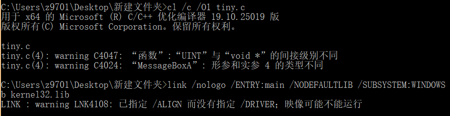
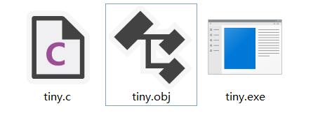
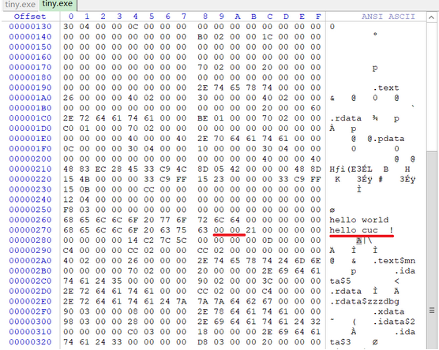
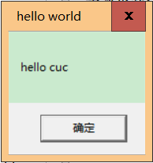

# 1.编写一个release版本的 hello world 程序。通过修改程序可执行文件的方式（不是修改源代码），使得程序运行后显示的内容不为hello world，变成 hello cuc！
提示：一定要在编译选项中将调试信息相关的编译连接选项去掉，否则程序体积会比较大，而且存在很多“干扰”信息。

### 实验步骤：

#### 1. 编写C语言程序：

		#include<Windows.h>
		int main()
		{
			MessageBoxA(NULL, "hello world!", "hello world", NULL);
			ExitProcess(0);
		}
#### 2. 编译和链接此程序（尽可能保证文件最小）

		cl /c /O1 tiny.c
		link /nologo /ENTRY:main /NODEFAULTLIB /SUBSYSTEM:WINDOWS /ALIGN:16 tiny.obj

#### 3. 用winhex二进制文件查看器查看可执行文件tiny.exe，找到hello world的位置将world直接改为cuc并用00填充后面的字节

#### 4. 再次运行tiny.exe可以看到成功改为hello cuc。

