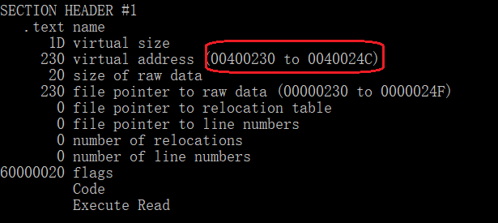
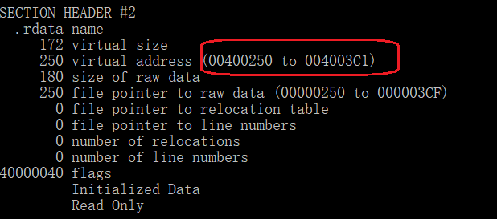
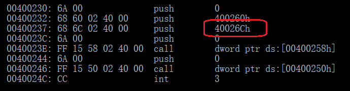
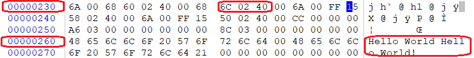
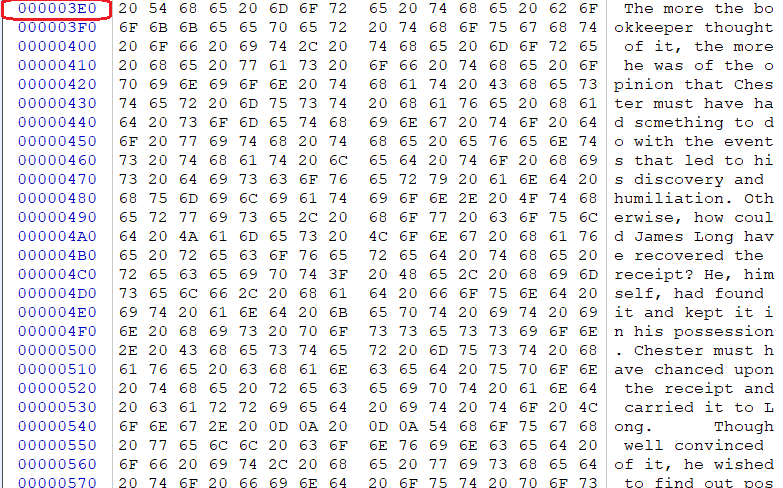
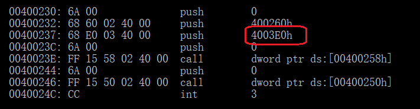

# 2、上一题的程序中，修改的显示内容变为一个很长的字符串（至少2kb长）。并且保证程序正常运行不崩溃。

- 提示，可执行文件中原有的空间有限，必须要新加入数据，加入数据后必须要修改.text字段中的指针。

### 实验步骤：

#### 1. 用dumpbin定位PE文件的代码段和数据段：

#### 2. 用dumpbin对可执行文件进行反汇编

#### 3. 将长字符串直接添加在二进制文件尾部

#### 4. 将前面数据段的40026Ch的地址更改为0003E0h直接显示更换后的内容

