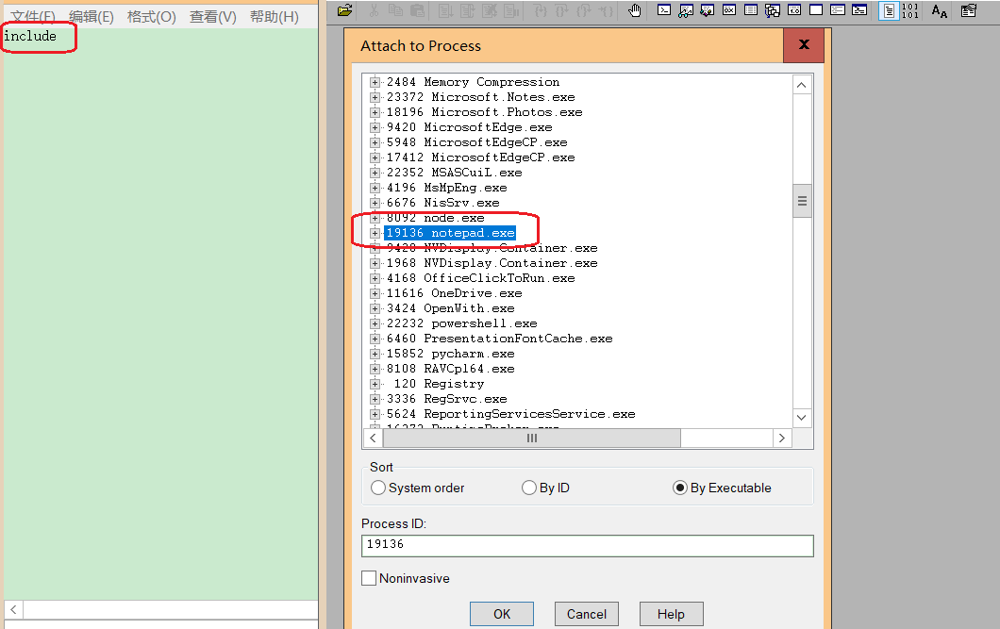
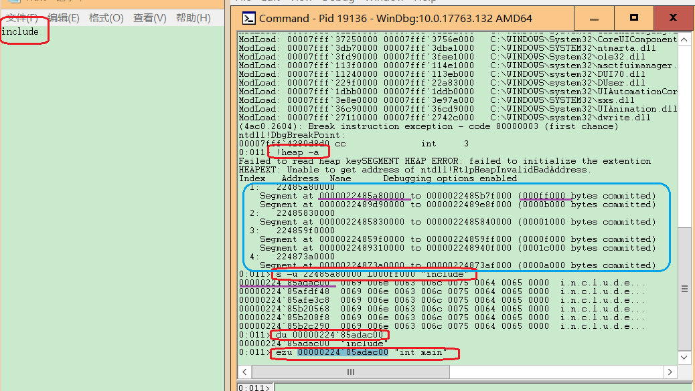
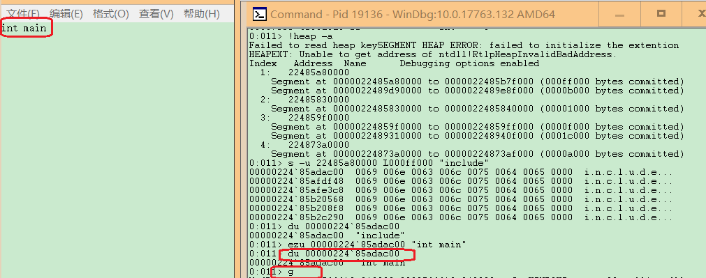

# 3、在notepad（32位64位均可）中，输入一段文字。然后使用调试器，在内存中修改这段文字。使得没有在界面操作notepad的修改文字的情况下。notepad中显示的文字变化。
- 提示：在调试器中定位控件缓存的内存地址，可以用搜索、逆向、消息截获分析、API截获分析等方法。

## Windbg直接修改内存

- 找到存放字符串的内存地址，对其进行修改，再让进程继续执行。

- 使用WinDbg添加notepad.exe。列出已分配的堆，并在其中查找字符串 ABCDABCD。

```
# 查看所有堆
!heap -a

# 查找字符串
s -u 22485a80000 L000ff000 "include"

# 显示Unicode
du 00000224`85adac00
```



- 修改第一个内存位置的数据，让进程继续运行，可以直接更改字符串

```
# 修改字符串
ezu 00000224`85adac00 "int main"

# 显示
du 00000224`85adac00

# 继续运行程序
g
```





## 参考资料

[https://blog.csdn.net/lixiangminghate/article/details/53086667](https://blog.csdn.net/lixiangminghate/article/details/53086667)

[https://github.com/jckling/Day-Day-Up/tree/sf/%E8%BD%AF%E4%BB%B6%E4%B8%8E%E7%B3%BB%E7%BB%9F%E5%AE%89%E5%85%A8/3](https://github.com/jckling/Day-Day-Up/tree/sf/%E8%BD%AF%E4%BB%B6%E4%B8%8E%E7%B3%BB%E7%BB%9F%E5%AE%89%E5%85%A8/3)